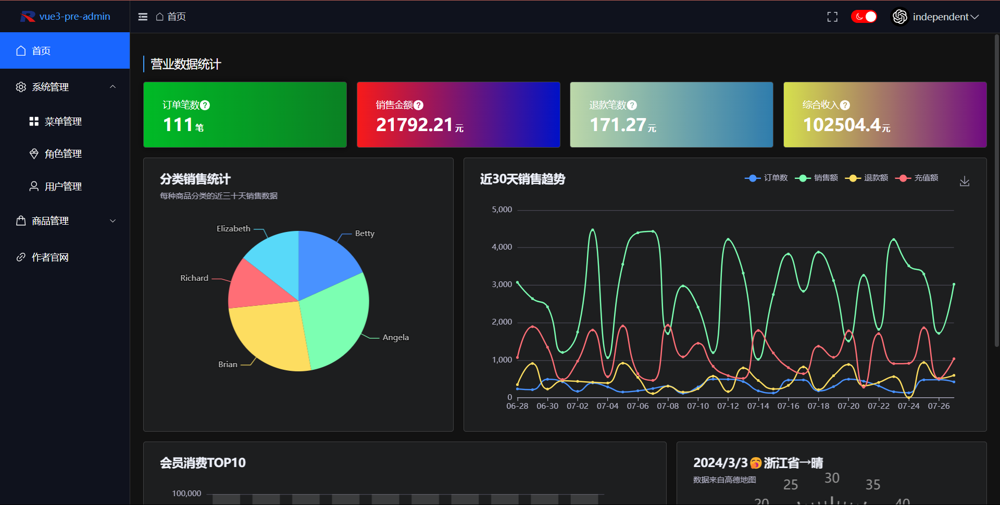
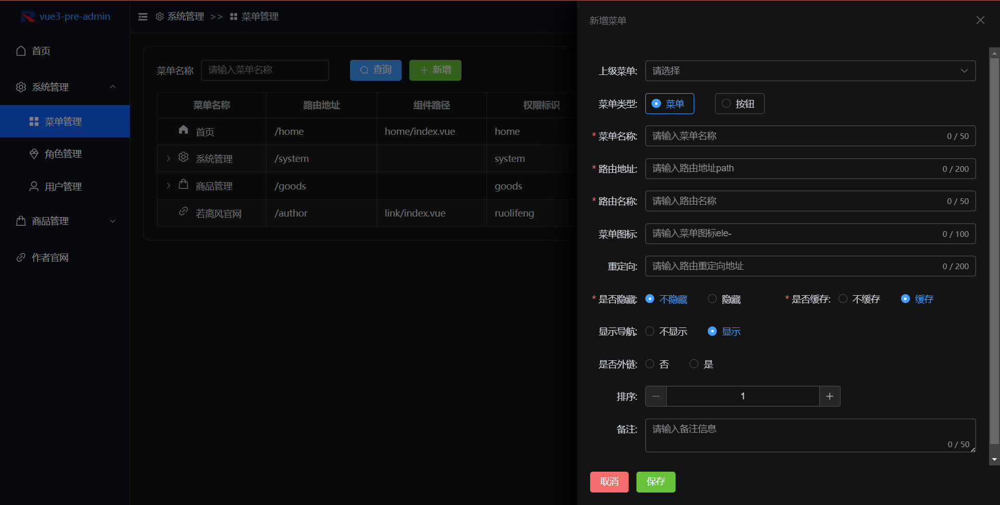
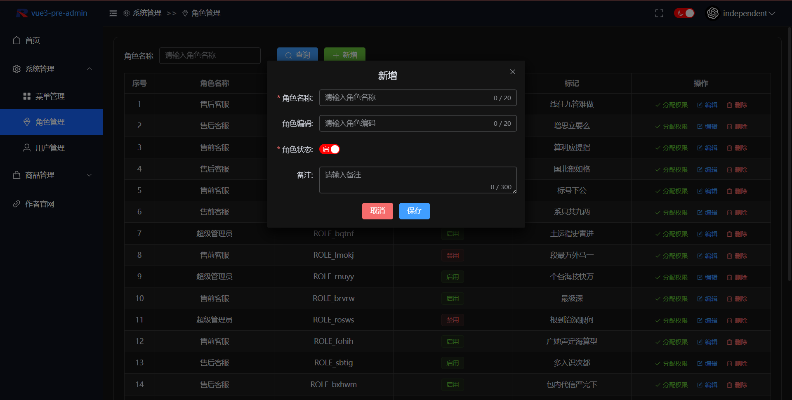
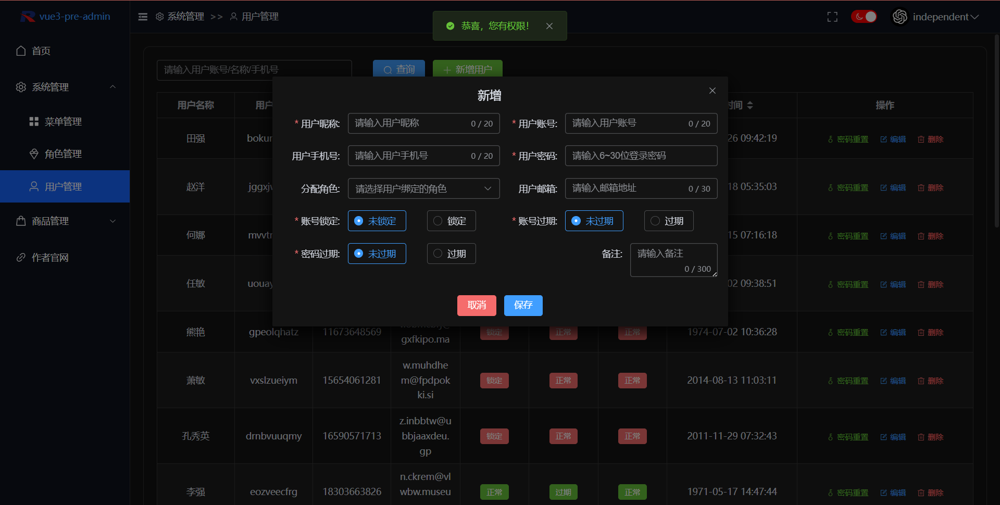
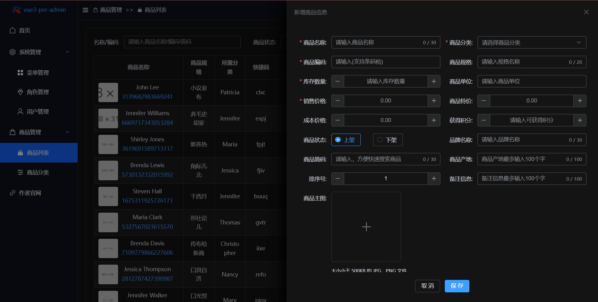
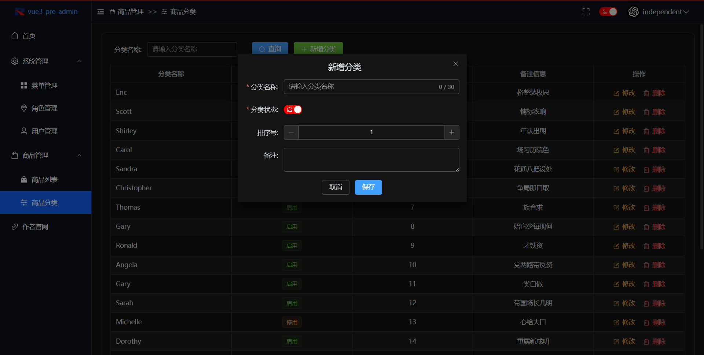
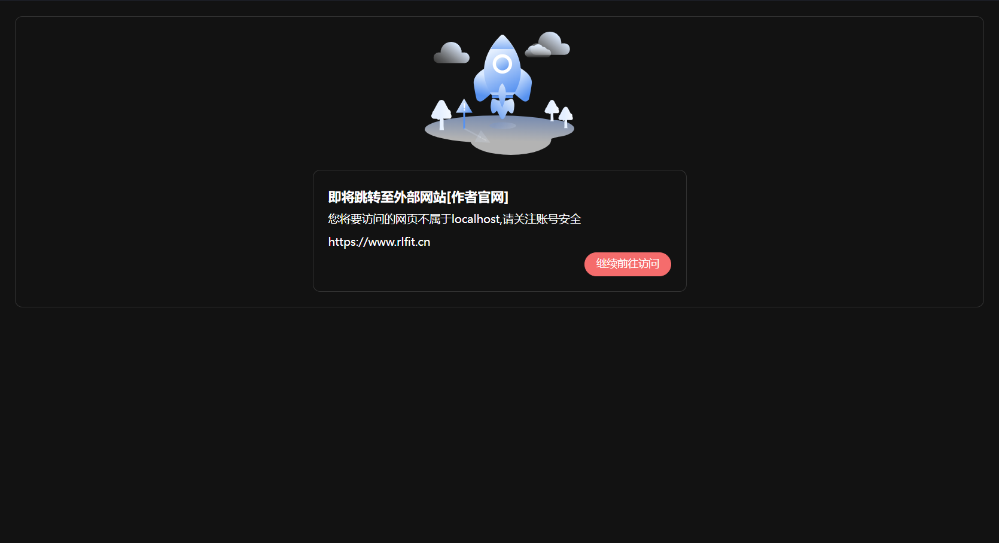

# vue3-pre-admin

一个基于vue3的通用后台管理系统，此项目主要是我的一个练手项目，在线体验地址:https://vue3.rlfit.cn，由于不稳定，各位可以fork之后基于下面的安装步骤进行使用

**主要**技术点：

|    技术点    | 功能               | 官网 |
| :----------: | ------------------ | ---- |
|     vue3     | 前端框架           |      |
|    pinia     | 状态管理           |      |
|  vue-router  | 路由管理           |      |
| element-plus | ui组件             |      |
|     Sass     | css扩展语法        |      |
|    axios     | 发送请求           |      |
|     vite     | vue框架            |      |
|    vueuse    | 实现全屏和暗黑模式 |      |
|   echarts    | 使用主页图表展示   |      |
| 富文本编辑器 | 添加商品描述信息   |      |

项目主要功能：

- 实现商品销售数据的动态图表展示
- 实现后端动态路由，路由数据完全请求后端接口提供，可搭配后端实现完整的权限方案
- 动态加载权限，权限按钮完全由后端控制
- 商品的上传和用户权限管理

项目亮点：

- 将用户管理及各种涉及重复代码的地方都提取成hooks，降低了代码的重复性
- 使用pinia作为状态管理器
- 实现了全屏以及暗黑模式的切换
- 项目数据完全由后端提供，增加了项目的可扩展性

项目截图
















## 部署

1. 环境：node.js 20.11.0

2. clone项目 

3. 进入根目录执行

   ```shell
   npm i
   npm run dev
   ```

作者主页：https://www.rlfit.cn
   
